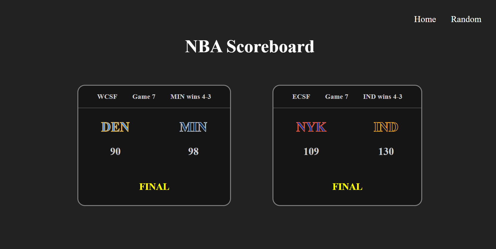
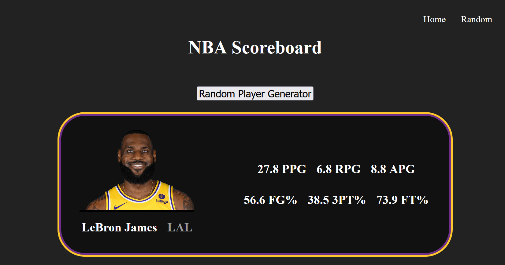

# NBA Scoreboard

A lightweight, local web server providing real-time updates for NBA game scores.



Displays player's stats with the **random** endpoint:



## Usage

Start the web server with:
```
docker-compose up -d
```

and stop the web server with:

```
docker-compose down
```

## Built With
The back-end server was developed with [![Flask]][Flask-url], and it consumes the [nba_api][nba_api-url] for live NBA data. The front-end was built with [![React.js]][React-url], and the project is containerized and hosted with [![Docker]][Docker-url]

## License

This project is licensed under the MIT License - see the LICENSE.md file for details

[React.js]: https://img.shields.io/badge/React-20232A?style=for-the-badge&logo=react&logoColor=61DAFB
[React-url]: https://reactjs.org/
[Flask]: https://img.shields.io/badge/Flask-000000?style=for-the-badge&logo=Flask&logoColor=white
[Flask-url]: https://flask.palletsprojects.com/en/3.0.x/
[nba_api-url]: https://github.com/swar/nba_api
[Docker]: https://img.shields.io/badge/Docker-grey?logo=docker
[Docker-url]: https://www.docker.com/